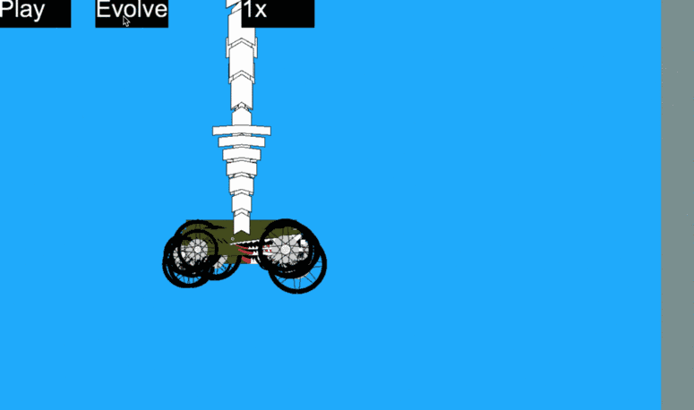

## MWG Evolution

This is the final project for our Mobile Web Graphics course (Fall 2014). It serves as an investigation of genetic algorithms and very, very simple neural networks.

We "evolve" a car-like creature with a scorpion-like tail on the basis of the amount of force it can apply to a wall over a given time period (by default 20 seconds in the most up-to-date demo). The intent is to produce creatures that are better at attacking the wall. Each creature has a body (represented by Box2D fixtures) and a mind (constructed as a very small neural network) to control different body parts. The mind is not a conventional neural network in that it is never trained, but it does co-evolve with the body generation-to-generation. In this way the operation of the mind can improve.

### What it looks like

### Current parameters that we evolve

**Torso:**

* The width of the torso.
* The height of the torso.
* The density of the torso.
* The friction of the torso.

**Wheels:**

* The radius of the wheel.
* The density of the wheel.
* The friction of the wheel.

**Wheel Joints:**

* The speed of the motor.
* The maximum torque of the motor.

**Tail:**

* The number of vertebrae in the tail.
* The width of the root vertebra.
* The height of the root vertebra.
* The density of the root vertebra.
* The maximum torque of the motor assigned to the root vertebra.
* The friction of the entire tail.
* The factor by which the width of each vertebra changes along the tail from root to end.
* The factor by which the height of each vertebra changes along the tail from root to end.
* The factor by which the density of each vertebra changes along the tail from root to end.
* The factor by which the torque of each vertebra changes along the tail from root to end.

**Mind:**

* The distance threshold at which the creature will begin attacking the wall. This distance is measured by the creature's Eye, then sent to its TailNeuron during the "thinking" step of the simulation.
* The amount of time the creature spends in each position of its movement pattern during the attacking phase.
* The maximum speed, by phase (at rest or attacking), that the creature will try to move the joints on its tail. The actual speed that it tries to move a given tail joint depends on the difference between that joint's angle and the angle that that joint is assigned for the current position in that creature's movement pattern.
* Note:  We do not presently evolve the number of key positions in the movement pattern or the angles for each stage of the movement pattern. The angles for the attack position change slightly depending on the number of neurons in the tail. Currently, the movement pattern consists of the creature cycling between the "at rest" and "attacking" tail positions.

---

### A few other items to note

* The code is in the root folder.

* Open `index.html` for the most up to date demo. You need to press the "Play" button to start the simulation. The "Evolve" button can be used to trigger evolution prematurely and the third button can be used to toggle time acceleration.

* Most documentation is inline with code, but some of it might be just a tiny bit out of date since we haven't gone through with a fine-tooth comb and updated it after our mad rush the night before our demo day. The demo code is messy. Don your hazmat suit before entering.

* Look in …
	- `app/Body` to see how creature body parts are designed,
	- `app/Creature` to see how creatures are designed,
	- and `app/Mind` to see how the neural networks that control the creatures are designed.

* The aspect ratio of your viewport might effect how the creatures evolve, because this affects the aspect ratio of the environment.

* We use Box2dWeb.js for physics simulation.

* We use PIXI.js for rendering.
